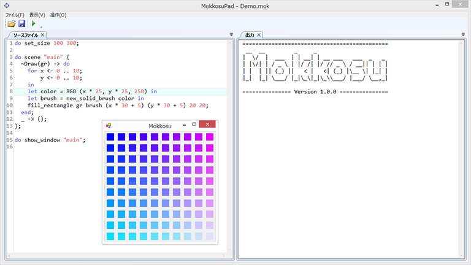

# プログラミング言語 Mokkosu

Mokkosuは全くのゼロから設計・開発されたオープンソースのプログラミング言語です。
Mokkosuは.NET Framework上で動作する関数型プログラミング言語で、ゲームや
ジェネラティブアートといったインタラクティブなプログラムの開発を得意とし
ています。

類似の言語としてはMITメディアラボで開発されたProcessingがあります。
Processingが手続型言語であるのに対して、Mokkosuは関数型言語であるため、
Processingとは異なるスタイルでのプログラミングが可能です。これにより
プログラムによってはProcessingより簡潔に記述できる可能性があります。

Mokkosuは単なるプログラミング言語にとどまらず、統合的な開発環境をユーザに
提供します。専用の統合開発環境が用意されており、シンタックスハイライト
機能の付いたエディタからワンボタンでプログラムを実行することが可能です。
2Dの描画に関しては専用のフレームワークを用意しており、従来の言語のような
煩雑な手続きを踏むことなく簡単にウインドウの表示や描画を行うことができます。
Mokkosuはドキュメントの整備にも力を入れており、とくに関数型言語未経験の
ユーザでも違和感なく始められるように、チュートリアル等を充実させています。

Mokkosuはコンパイラ言語です。作成したプログラムは、.NET Frameworkが動作する
環境であれば、追加のランタイム等をインストールすることなく実行することができ
ます。.NET Frameworkで動作する関数型言語であるF#は専用のランタイムのインスト
ールを要求しますが、Mokkosuではそのようなことはありません。

Mokkosuは描画と関数型という一見相反するもの同士を組み合わせた新しい試みの言語
です。Mokkosuを使うことで、インタラクティブな楽しいプログラムが今後開発されて
行くことを期待しています。
