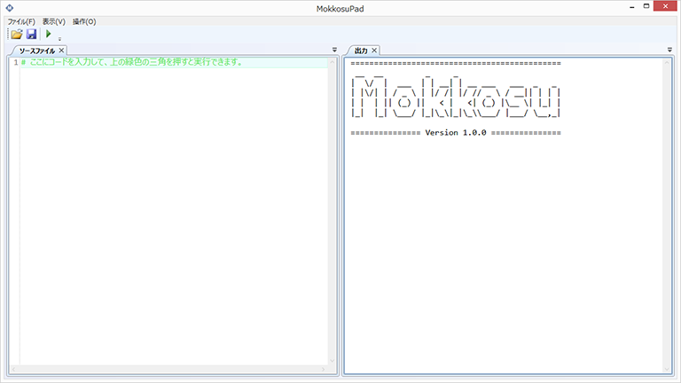
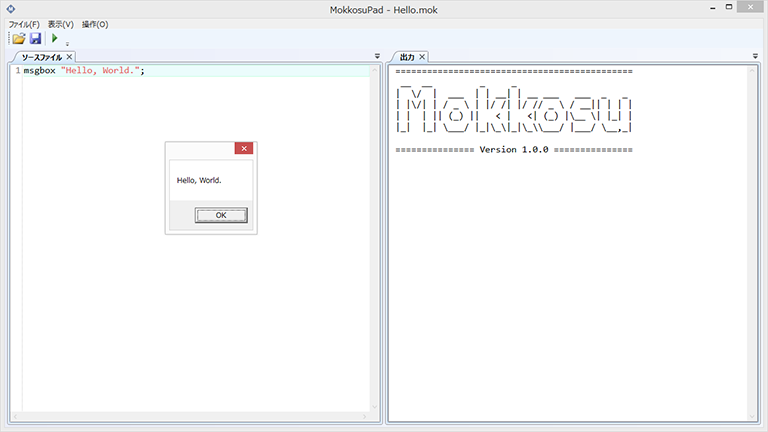
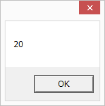
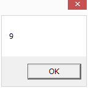
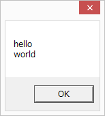
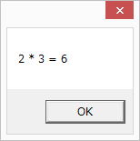

# チュートリアル (パート1)

## Mokkosuをインストールしよう

[Mokkosuのリリースページ](https://github.com/lambdataro/Mokkosu/releases)
から最新バージョンのインストーラをダウンロードしてきます。


ダウンロードしてきたインストーラーをダブルクリックして実行し、
画面の指示に従ってインストールします。

インストールが完了するとスタートメニューとディスクトップに
MokkosuPadのショートカットが作成されます。


作成されたショートカットをダブルクリックすると、
MokkosuPadが起動し以下の画面が表示されればインストールは成功です。



## メッセージを表示しよう
### メッセージボックスの表示

ソースファイルの緑色の文字を消去して以下のプログラムを入力
してみましょう。

```
msgbox "Hello, World.";
```

`ファイル`メニューから`名前を付けて保存`を選んで、
ソースコードを`Hello.mok`という名前で保存します。

`操作`メニューから`実行`を選ぶと、
Hello, World.と書かれたメッセージボックスが表示されます。



### 練習問題1
画面に自分の名前を表示するプログラムを作成して実行してみましょう。

## 式の計算をしよう
Mokkosu で式を計算して結果を表示するプログラムを書きましょう。

以下は`2 + 3 * 4`を計算して表示するプログラムです。

```
msgbox(int (2 + 3 * 4));
```

ここで`int`は整数値を文字列に変換する関数です。
`msgbox`関数の引数は文字列でなければならないのでこのような
変換が必要になります。

プログラムを実行すると以下の表示が出ます。


計算結果が`14`になっていることに注目してください。
Mokkosuでは数学のように足し算や引き算よりも掛け算や割り算の方が
先に計算されます。

数学と同じように括弧を使って先に計算する
部分を明示することもできます。
例えば上の式で`2 + 3`を先に計算したければ、

```
msgbox(int ((2 + 3) * 4));
```

と書きます。実行すると今度は以下のように表示されます。



上のプログラムは括弧が多くて見づらいと感じる方もいると思います。
その場合、以下のように書くことで多少見やすくすることができます。

```
msgbox((2 + 3) * 4 |> int);
```

ここで`|>`は左辺の計算結果を右辺の関数に受け渡す役割があります。

### 練習問題2
底辺の長さが10高さが5の三角形の面積を計算するプログラムを書いて
実行してください。

## 計算結果に名前を付けよう

`let`文を使うと計算結果に名前を付けてプログラムを分かりやすくしたり、
結果を保存したりできます。

以下のプログラムでは、文字列`"Hello, World."`に`message`と名前を
を付けて、`msgbox`関数の内部で参照しています。

```
let message = "Hello, World.";
msgbox message;
```

Mokkosuでは関数の引数に括弧は不要です。
複数の引数をスペースで区切って与えることが関数の呼び出しが実現できます。

上のプログラムを実行すると以下のように表示されます。


今回のプログラムはこれまでのものと違って、
出力ウインドウに以下のように表示されます。

```
message : String
```

これは変数`message`に文字列値が格納されていることを
表しています。

以下は変数に整数値を格納した例です。

```
let x = 1 + 2;
msgbox(x * x |> int);
```

実行すると出力ウインドウに

```
x : Int
```

と表示されて以下が表示されます。



`x : Int`は`x`に整数値が格納されていることを
表しています。

### 練習問題3
`let`と変数を使って2の8乗を計算するプログラムを書いて実行してください。

## 関数を定義しよう

Mokkosuでは簡単に関数を定義することができます。

以下は引数の値を倍にして返す関数`double`を定義して使う例です。

```
fun double x = x * 2;
msgbox (double 10 |> int);
```

実行すると以下のように表示されます。


右の出力ウインドウに注目すると、

```
double : Int -> Int
```

と表示されていることに気付くと思います。
これは関数`double`が整数を受け取って整数を返す関数であることを示しています。
矢印の左側が引数の型で、右側が戻り値の型です。

関数が引数を複数持つ場合は、引数名を複数並べます。

以下は四角形の幅と高さが与えられた時に、
その四角形の面積を返す関数を定義して使う例です。

```
fun area width height = width * height;
msgbox (area 3 5 |> int);
```

実行すると以下のように表示されます。


型は以下のようになります。

```
area : Int -> Int -> Int
```

複数の引数をもつ関数の型はこのように引数の型を`->`で区切った型になります。

### 練習問題4
三角形の面積を求める関数を定義してください。

## 条件に応じて分岐しよう

条件に応じて分岐するには`if`式を使います。

例えば、引数の整数の絶対値を求める関数`abs`は以下のように定義できます。

```
fun abs x =
  if x < 0 -> ~-x
  else x;

msgbox (abs 5 |> int);
msgbox (abs ~-3 |> int);
```

ここで`~-`は符号を反転させる演算子です。

実行すると以下のように表示されます。


### 練習問題5
引数を2つ受け取ってそれらが等しければ2倍した値を返す関数を定義してください。
2つの値が等しいかどうかを調べる演算子は`==`です。

## 再帰関数を定義しよう

再帰関数とは自分自身を呼び出す関数のことです。
以下のプログラムでは自分自身を呼び出すことで、
引数の整数の階乗を計算する関数`fact`を定義して使っています。

```
fun fact n =
  if n == 0 -> 1
  else n * fact (n - 1);

msgbox (fact 5 |> int);
```

実行すると以下のように表示されます。


### 練習問題6
1から10までの整数を足した和を計算する関数を再帰関数を用いて定義してください。

### 練習問題7
フィボナッチ数列のn項目を計算する関数を再帰関数を用いて定義してください。

## まとめと落穂拾い
### メッセージの表示
メッセージを表示するには`msgbox`関数を使います。

複数の`msgbox`の呼び出しを書いた場合は、ソースコードの
上から順番に実行されていきます。

### 整数リテラル
文字列は
```
"abc"
```
のようにダブルクォーテーションマークで文字列を区切って表します。

ダブルクォーテーション自体や特殊文字を表すために、
以下のエスケープシーケンスが定義されています。

|エスケープシーケンス | 意味 |
|----------|-----------------|
| \' | 単一引用符 |
| \" | 二重引用符 |
| \\ | 円記号 |
| \0 | ヌル |
| \a | 警告 |
| \b | バックスペース |
| \f | フォームフィード |
| \n | 改行 |
| \r | キャリッジリターン }
| \t | 水平タブ |
| \uxxxx | ユニコード文字 |
| \v | 垂直タブ |

例えば以下のプログラムを実行すると、
```
msgbox("hello\nworld");
```



と表示されます。

### 整数リテラル
整数値は
```
123
```
のように数字を並べて表現します。

以下のように16進数や8進数、2進数で整数値を表現することもできます。
```
0xff
0o644
0b1101
```

### 整数演算子
整数に関する演算子には以下のものがあります。

|演算子   |意味|
|---------|----|
|式1 + 式2|加算|
|式1 - 式2|減算|
|式1 * 式2|乗算|
|式1 / 式2|除算|
|式1 % 式2|剰余|
|~- 式|符号反転|

### 整数から文字列への変換
`int`関数を使うと整数を文字列に変換できます。

### 文字列同士の連結
`^`演算子で2つの文字列を連結できます。

例えば以下のプログラムを実行すると、

```
msgbox ("2 * 3 = " ^ int (2 * 3));
```



と表示されます。

### 関数適用演算子
```
式2 |> 式1
```
は
```
式1 式2
```
と同じ意味になります。

また、
```
式1 <| 式2
```
は
```
式1 式2
```
と同じ意味になります。
`|>`演算子は優先度が低いので関数の引数の括弧を省略するときに使います。

### let文
```
let 名前 = 式;
```
`let`式を使うことで式に名前を付けることができます。
名前として利用可能な文字列はアルファベット、数字、アンダースコアです。
ただし名前の最初の一文字は数字以外である必要があります。

### fun文
```
fun 名前 引数名1 引数名2 ... = 式;
```
`fun`式を使うと(再帰)関数を定義することができます。

### if式
```
if 条件式 -> 式1 else 式2
```
if式は条件式を計算して値が`true`になれば式1を計算し、
`false`になれば式2を計算します。

条件が複数ある場合は以下のように`else`の後ろにもう一つ`if`式を書きます。

```
if 条件式1 -> 式1
else if 条件式2 -> 式2
...
else 式
```

